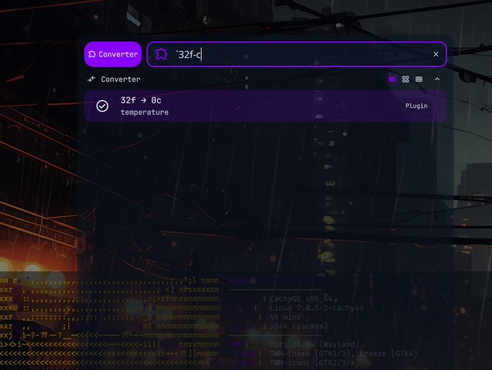

# Converter

A launcher plugin for DankMaterialShell that converts units inline — type a value, a hyphen, and a target unit, get the result instantly. Enter copies it to the clipboard.



## Usage

Open the launcher and type the trigger (`` ` `` by default), then:

```
<value><unit>-<target unit>
```

Examples:

```
`5m-km        →  0.005km
`32f-c        →  0c
`100lb-kg     →  45.3592kg
`1gal-l       →  3.7854l
`60mph-km/h   →  96.5606km/h
```

Press Enter on the result to copy it to the clipboard (via `dms clipboard copy`).

Units are case-insensitive. Cross-category conversions (e.g. weight to temperature) are rejected with an error message.

## Supported Units

| Category | Units |
|----------|-------|
| Distance | μm, nm, mm, cm, dm, m, km, in, ft, yd, mi, nmi, thou, mil |
| Weight | ng, μg, mg, g, kg, t, mt, gr, dr, oz, lb, st, ton, cwt |
| Temperature | c, f, k |
| Speed | m/s, km/h, mph, knot, ft/s, in/s |
| Volume | ul, ml, cl, dl, l, tsp, tbsp, fl oz, cup, pint/pt, quart/qt, gal, barrel |
| Area | mm2, cm2, m2, km2, in2, ft2, yd2, mi2, acre, hectare |
| Energy | j, kj, cal, kcal, wh, kwh, ev |

Results are auto-formatted: large values get fewer decimals, small values get up to 6.

## Installation

1. Copy the `converter` folder to `~/.config/DankMaterialShell/plugins/converter/`
2. Restart DMS: `systemctl --user restart dms`
3. Enable the plugin in the DMS plugins menu

## Configuration

- **Trigger**: launcher prefix, defaults to `` ` `` (backtick). Persisted via plugin settings.
- The settings page lists all supported units and usage examples for quick reference.

## Files

- `Converter.qml` - Launcher component (parsing, conversion, clipboard action)
- `ConverterSettings.qml` - Plugin settings / unit reference
- `plugin.json` - Plugin manifest
- `README.md` - This file

## Requirements

- DankMaterialShell (launcher plugin support)
- `dms` CLI on PATH (clipboard copy)

## Permissions

- `settings_read`, `settings_write` — persists the custom trigger

## Author

viewerofall
